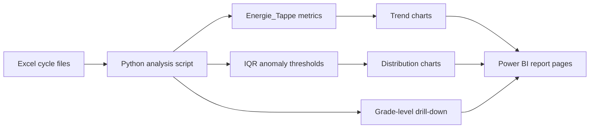

# Steel Cycle Anomaly Detection for Power BI

This project analyzes Electric Arc Furnace (EAF) cycle Excel files and turns them into anomaly-focused visuals that are easy to reuse in reporting, operational reviews, and Power BI dashboards.

The analysis centers on two production metrics:

- `Energie_Tappe = (Energie Elec. * 1000) / Poids Tappé`
- `Energie_Tappe_PowerOn = ((Energie Elec. * 1000) / Poids Tappé) * Power On`

It supports:

- single-file processing with `--file`
- folder processing with `--folder`, where all `.xlsx` files are merged into one yearly dataset
- automatic anomaly detection based on IQR thresholds
- drill-down analysis by steel grade

The repository includes generated yearly visualization examples for `2024`, `2025`, and `2026`.

## Why It Fits Power BI

This repository is a good base for a Power BI reporting workflow because it already produces the core visual story:

- trend monitoring by cycle
- anomaly highlighting with lower and upper thresholds
- distribution views to spot concentration and outliers
- grade-level drill-down for operational segmentation

In Power BI terms, these outputs map naturally to:

- KPI cards: total cycles, anomalous cycles, anomaly rate, median ratio
- trend page: cycle-by-cycle monitoring with anomaly thresholds
- distribution page: count view showing normal values vs. out-of-range bins
- drill-down page: slicers by year, metric, and grade

## Visualization Demo

### Year-Level Monitoring

| Anomaly trend view | Distribution view |
| --- | --- |
|  |  |

These two views are the closest match to a standard Power BI monitoring page:

- the line chart shows cycle evolution with detected anomalies in red
- the count chart shows how values are distributed and where the anomaly zone starts

### Drill-Down by Grade and Metric

| Standard metric view | Power On metric view |
| --- | --- |
|  |  |

This is the part that makes the project especially useful for Power BI-style analysis:

- one view tracks the standard energy ratio over time
- another compares the second metric, `Energie_Tappe_PowerOn`
- the script can also generate grade-specific outputs for drill-down reporting

## Data-to-Dashboard Flow



## Requirements

- Python `3.11+`
- Packages:
  - `pandas`
  - `matplotlib`
  - `openpyxl`

## Setup

```bash
python3 -m venv .venv
source .venv/bin/activate
pip install pandas matplotlib openpyxl
```

## Usage

### Process a Folder

This is the recommended mode when you want a yearly dashboard-style view.

```bash
python script.py --folder 2024
python script.py --folder 2025
python script.py --folder 2026
```

### Process a Single File

```bash
python script.py --file 1.xlsx
```

### Optional Anomaly Threshold Factor

Default anomaly thresholds are:

- `Lower = Q1 - 1.5 * IQR`
- `Upper = Q3 + 1.5 * IQR`

You can change the sensitivity:

```bash
python script.py --folder 2025 --factor 1.5
```

## Output Files

For each processed folder, the script generates:

- `anomalies/*_energie_tappe_power_on_anomalies.png`
  - trend view for `Energie_Tappe_PowerOn` with anomaly markers and thresholds
- `counts/*_energie_tappe_power_on_counts.png`
  - distribution view for `Energie_Tappe_PowerOn`
- `anomalies/*_energie_tappe_anomalies.png`
  - trend view for `Energie_Tappe`
- `counts/*_energie_tappe_counts.png`
  - distribution view for `Energie_Tappe`
- `grades/anomalies/*.png`
  - grade-specific anomaly views
- `grades/counts/*.png`
  - grade-specific distribution views

These outputs are useful in two ways:

- directly as visual evidence in reports and presentations
- as a visual reference when recreating the same dashboard logic in Power BI

## Recommended Power BI Report Structure

If you want to turn this repository into a more complete Power BI project, this is the cleanest report structure:

1. Executive Overview
   Total cycles, anomaly count, anomaly rate, and median energy ratio.
2. Process Monitoring
   Line chart by `Cycle` with upper and lower anomaly bounds.
3. Distribution Analysis
   Histogram or column chart showing normal range vs. anomalous values.
4. Grade Analysis
   Slicers for `Year`, `Grade`, and `Metric`, plus a detailed anomaly trend chart.

## Next Step to Make It Even More Power BI-Native

The current project already generates strong visual outputs. The next logical improvement would be to export anomaly detail tables such as:

- `cycle`
- `grade`
- `metric`
- `ratio`
- `is_anomaly`
- `lower_bound`
- `upper_bound`

That would allow direct import into Power BI for fully interactive dashboards, DAX measures, and slicer-based exploration.

## Notes

- Rows with invalid metric columns (`<= 0`) are excluded per metric.
- The count plot x-axis starts at `0` to avoid misleading visual negative values.
- Grade-specific plots are generated only when a valid `Grade` column is present.
