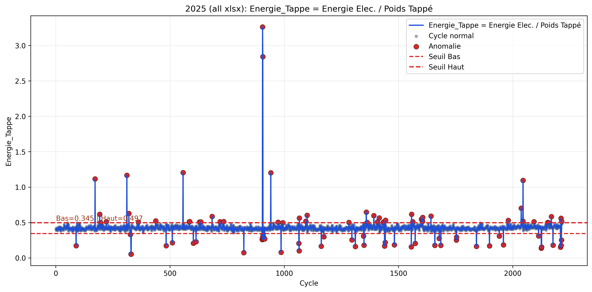
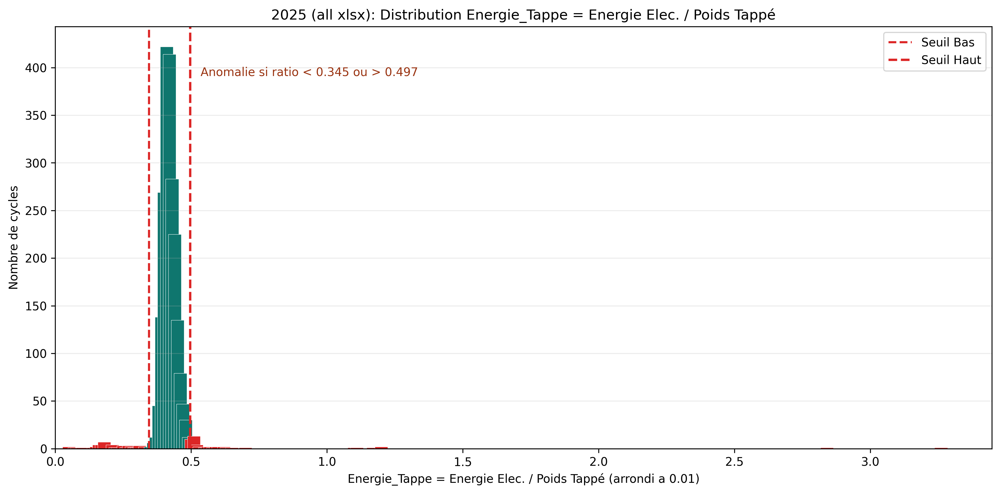
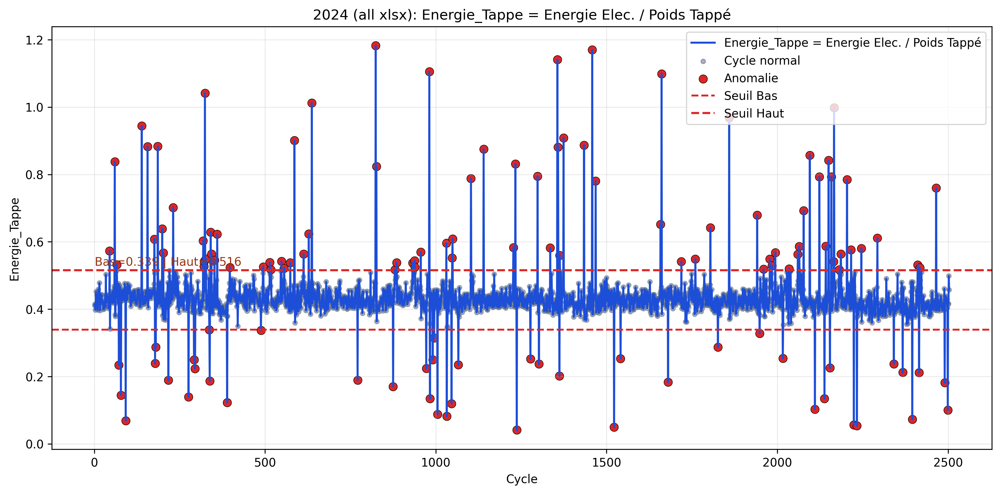
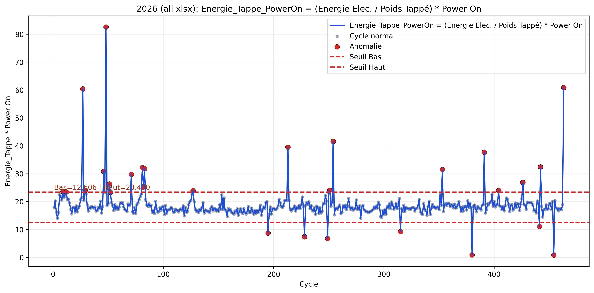
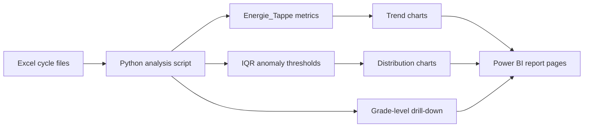

# Steel Cycle Anomaly Detection for Power BI

This project analyzes Electric Arc Furnace (EAF) cycle Excel files and turns them into anomaly-focused visuals that are easy to reuse in reporting, operational reviews, and Power BI dashboards.

The analysis centers on two production metrics:

- `Energie_Tappe = (Energie Elec. * 1000) / Poids Tappé`
- `Energie_Tappe_PowerOn = ((Energie Elec. * 1000) / Poids Tappé) * Power On`

It supports:

- single-file processing with `--file`
- folder processing with `--folder`, where all `.xlsx` files are merged into one yearly dataset
- automatic anomaly detection based on IQR thresholds
- drill-down analysis by steel grade

The repository includes generated yearly visualization examples for `2024`, `2025`, and `2026`.

## Visualization Demo

### Year-Level Monitoring

| Anomaly trend view                                                    | Distribution view                                                      |
| --------------------------------------------------------------------- | ---------------------------------------------------------------------- |
|  |  |

These two views are the closest match to a standard Power BI monitoring page:

- the line chart shows cycle evolution with detected anomalies in red
- the count chart shows how values are distributed and where the anomaly zone starts

### Drill-Down by Grade and Metric

| Standard metric view                                                          | Power On metric view                                                                   |
| ----------------------------------------------------------------------------- | -------------------------------------------------------------------------------------- |
|  |  |

This is the part that makes the project especially useful for Power BI-style analysis:

- one view tracks the standard energy ratio over time
- another compares the second metric, `Energie_Tappe_PowerOn`
- the script can also generate grade-specific outputs for drill-down reporting

## Data-to-Dashboard Flow



## Requirements

- Python `3.11+`
- Packages:
  - `pandas`
  - `matplotlib`
  - `openpyxl`

## Setup

```bash
python3 -m venv .venv
source .venv/bin/activate
pip install pandas matplotlib openpyxl
```

## Usage

### Process a Folder

This is the recommended mode when you want a yearly dashboard-style view.

```bash
python script.py --folder 2024
python script.py --folder 2025
python script.py --folder 2026
```

### Process a Single File

```bash
python script.py --file 1.xlsx
```

### Optional Anomaly Threshold Factor

Default anomaly thresholds are:

- `Lower = Q1 - 1.5 * IQR`
- `Upper = Q3 + 1.5 * IQR`

You can change the sensitivity:

```bash
python script.py --folder 2025 --factor 1.5
```
